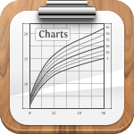
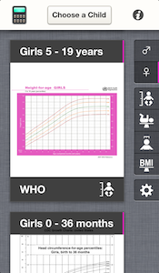
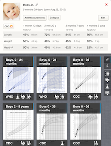



Whether  you are a parent caring for your own child or a pediatrician, **this growth charts app is for you!** Developed as part of a research project at [Boston Children's Hospital][bch], you can track your childrens' growth over time and display the data points on any of the included WHO and CDC charts. There is also a percentile calculator for quick lookup  of weight, length, head circumference and BMI percentiles in case you just want to know the percentile of today's measurement. 👶

Screenshots
-----------

	

		 
		iPhone
	

	

		 
		iPad
	

---

Included Charts
---------------

The app currently includes the official growth charts from these institutions:

* [World Health Organization][who]
  * 0 - 24 months (weight, height and head circumference)
  * 2 - 5 years (weight and height)
  * 5 - 10 years (weight)
  * 5 - 19 years (height and BMI)

* [Centers for Disease Control and Prevention][cdc] (US)
  * 0 - 36 months (weight, height and head circumference)
  * 2 - 20 years (weight, height and BMI)

Data Storage
------------

You can add as many children and measurements to the built-in database as you like. The data is encrypted -- if you have a passcode on your device -- meaning it is secure should you lose the device. This is your data, it doesn't leave the app.

Feedback & Support
==================

If you are having problems with the app or have suggestions, head over [to the issue page][issues] and let us know!

[bch]: http://childrenshospital.org
[who]: http://www.who.int
[cdc]: http://www.cdc.gov
[chip]: http://www.chip.org
[snf]: http://www.snf.ch
[issues]: https://github.com/p2/growth-charts/issues
