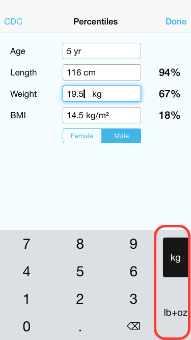



 Whether you are a **parent** caring for your own child or a **pediatrician**, this growth charts app is for you! It allows you to track childrens' growth over time and display the data points on any of the included WHO and CDC growth charts. You can track **height**, **weight**, **head circumference** and **BMI** and determine the corresponding percentiles.

There is also a **percentile calculator** for quick percentile lookup in case you just want to know the percentile of today's measurements.

	<a class="screenshot" href="../screenshots">
		 
		iPhone
	</a>
	<a class="screenshot" href="../screenshots">
		 
		iPad
	</a>

For more screenshots visit our [screenshots page](../screenshots).

Data Storage
------------

You can add as many children and measurements to the built-in database as you like. The data is encrypted – if you have a passcode on your device – meaning it is secure should you lose the device. Please also see our [privacy policy](../privacy-policy).

Sharing
-------

The measurements are directly added to the growth chart PDFs. You can email these PDFs or print them out (if you have an AirPrint enabled printer nearby).

Included Charts
---------------

The app currently includes 32 official growth charts from these institutions:

* **World Health Organization** ([WHO])
  * 0 - 24 months (weight, height and head circumference)
  * 2 - 5 years (weight and height)
  * 5 - 10 years (weight)
  * 5 - 19 years (height and BMI)

* **Centers for Disease Control and Prevention** ([CDC])
  * 0 - 36 months (weight, height and head circumference)
  * 2 - 20 years (weight, height and BMI)

Units
-----

Whether you're used to the **metric system** and have all data available in centimeter and kilogram or whether you're in the US and using **imperial units**, Charts has got you covered. You can switch the units you want to use for input and display right from the keyboard when you enter data or from a separate screen:

	

Requirements
------------

To run this app you will need a device running **iOS version 6.0** or newer.

Feedback & Support
==================

If you are having problems with the app or have suggestions, head over [to the issue page][issues] and let us know! 👶

[bch]: http://childrenshospital.org
[who]: http://www.who.int
[cdc]: http://www.cdc.gov
[chip]: http://www.chip.org
[snf]: http://www.snf.ch
[issues]: https://github.com/p2/growth-charts/issues
